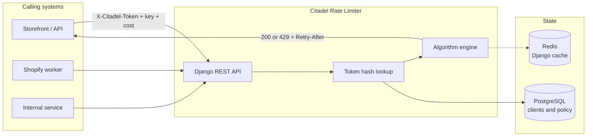
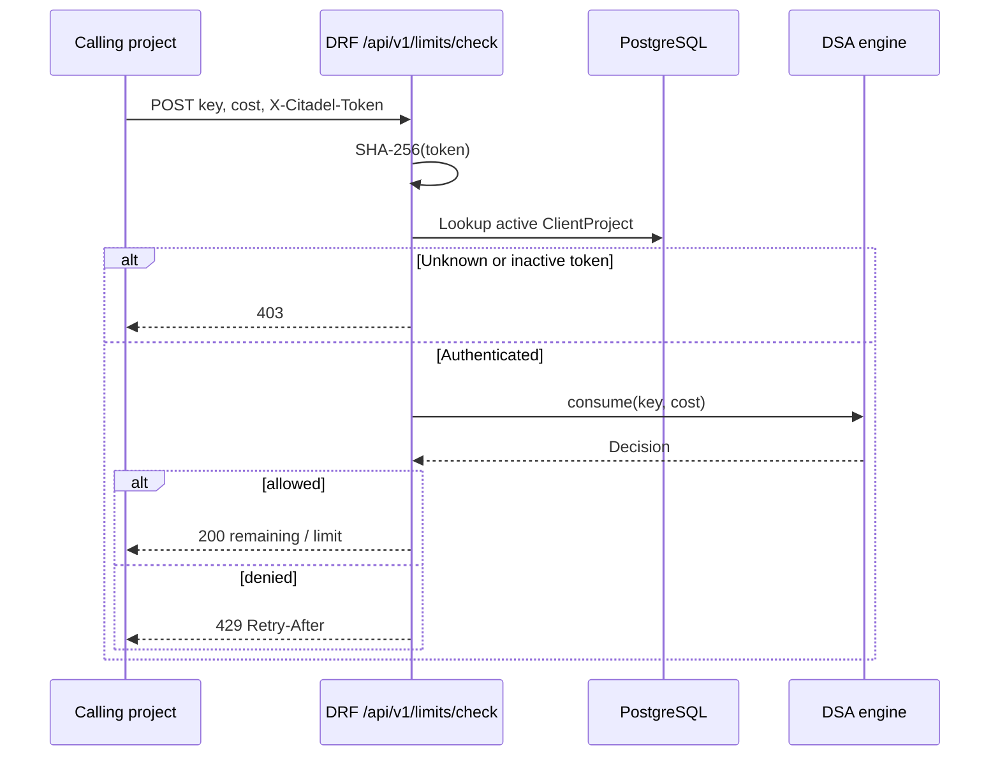

# Citadel Rate Limiter

A shared **rate-limiting control plane** for other Citadel applications.

Other projects do not implement their own throttling. They call this service with an identity key and a cost. Citadel decides **allow** or **deny** using classic traffic-shaping algorithms, then returns remaining capacity and retry timing so callers can back off cleanly.

Built with **Python, Django REST Framework, PostgreSQL, Redis, and Docker**.

---

## Why it exists

APIs, shop integrations, and internal tools share one problem: a noisy client can starve everyone else. Copy-pasting limiters into every repo creates drift — different keys, different windows, no shared policy.

Citadel Rate Limiter is the single place that:

1. Authenticates a calling project by hashed API token.
2. Applies a named algorithm (token bucket, sliding window, or Shopify leaky bucket).
3. Returns a machine-readable decision (`200` allow / `429` limited) plus Shopify-compatible limit headers.

Recruiters scanning this repo should see a **backend systems** project: HTTP API design, algorithm choice, service isolation, and a Docker-based runtime — not a UI demo.

---

## What a caller sees

```http
POST /api/v1/limits/check/
X-Citadel-Token: <project token>
Content-Type: application/json

{"key": "orders:create:shop-1", "cost": 1}
```

| Result | HTTP | Meaning |
| --- | --- | --- |
| Allowed | `200` | Request may proceed. Body includes `remaining` and `limit`. |
| Limited | `429` | Over budget. `Retry-After` is set. |

Also exposed:

- `GET /health/` — liveness
- `GET /api/docs/` — OpenAPI / Swagger
- `GET /api/schema/` — raw OpenAPI schema

---

## Architecture



**Request path**

1. The caller sends `key` (what to limit) and `cost` (how expensive the action is).
2. `X-Citadel-Token` is hashed with SHA-256 and matched to an active `ClientProject`. The raw token is never stored.
3. Policy on that client selects the algorithm and numeric limits (`capacity`, `refill_rate`, `window_seconds`).
4. The DSA engine returns a `Decision`: allowed, remaining, limit, retry-after.
5. The Shopify adapter maps the same decision into `X-Shopify-Shop-Api-Call-Limit` style fields so shop integrations can reuse familiar headers.



---

## System design concepts

These are the same primitives used in gateways, payment APIs, and commerce platforms. Citadel implements them as swappable strategies on each client.

### Token bucket

Capacity is a bucket of tokens. Time refills tokens at `refill_rate` per second, capped at `capacity`. A request of `cost` is allowed only if enough tokens remain.

- Smooths bursts, then enforces a long-run rate.
- Default mental model: “40 requests in the bucket, restore 2 per second.”

### Sliding window

A rolling time window of `window_seconds` counts events. When the count plus `cost` would exceed `capacity`, the request is denied until the oldest event ages out.

- Fairer than a fixed calendar window (no reset-at-midnight spike).
- Fits “N actions per minute” product rules.

### Shopify leaky bucket

Shopify’s REST Admin API uses a leaky bucket: a fixed bucket size that leaks (restores) at a steady rate. Citadel’s `shopify_leaky_bucket` strategy uses the same numbers by default (**40** capacity, **2** restores/second) and emits Shopify-shaped limit metadata.

That lets other Citadel apps throttle outbound Shopify traffic *before* Shopify returns `429`, which protects shared app credentials.

### Identity and tenancy

Limits are not global. The pair `(client token, key)` is the unit of accounting. One client can isolate shops, users, or routes with different keys (`orders:create:shop-1` vs `webhooks:shop-1`).

Tokens are stored as hashes. Bootstrap from `CITADEL_API_TOKEN` creates or updates the local Docker client without writing secrets into git.

---

## Runtime topology

Docker Compose is the local production-shaped stack:

| Container | Role |
| --- | --- |
| `citadel-api` | Gunicorn + Django REST API |
| `citadel-postgres` | Client registry and policy |
| `citadel-redis` | Cache backend |

Optional profiles (not required to run the core service):

| Profile | Tool | Why |
| --- | --- | --- |
| `tools` | Shopify Toxiproxy | Inject latency, timeouts, and faults in front of the API |
| `security` | OWASP ZAP | Baseline security scanning against the running service |

Promotion path: **DEVELOPMENT → STAGING → MAIN**, each mapped to a GitHub Environment. Images publish to Docker Hub as `backtofrontdev/citadel-rate-limiter`.

---

## Tech stack

| Layer | Choice |
| --- | --- |
| Language | Python 3.12–3.13 |
| API | Django 5.2, Django REST Framework, OpenAPI (drf-spectacular) |
| AuthN of callers | `X-Citadel-Token` → SHA-256 → `ClientProject` |
| Data | PostgreSQL 16, Redis 7 |
| Packaging | Poetry (`pyproject.toml`) with `requirements/` pip fallback |
| Process | Gunicorn, WhiteNoise |
| Containers | Docker Desktop Compose, multi-stage-style slim Python image |
| Quality | pytest, Gitleaks on every push, Docker image publish on branch push |

---

## Repository map

```
citadel/                 Django project, split settings (development / staging / production)
limiter/
  dsa/                   Token bucket, sliding window, leaky bucket + CLI simulator
  shopify/               Shopify-shaped decision adapter
  models.py              ClientProject policy
  views.py               Health + rate-limit check
docker-compose.yml       api + postgres + redis
docker/toxiproxy/        Fault-injection proxy config
.github/workflows/       CI, secret scan, Docker Hub publish
requirements/            pip extras aligned with Poetry groups
```

Simulate algorithms without the HTTP stack:

```powershell
poetry run python -m limiter.dsa --algorithm token_bucket --requests 20
```

---

## Run it

**Docker Desktop** (API, Postgres, Redis):

```powershell
copy .env.example .env
docker compose up --build
```

| Service | Local URL |
| --- | --- |
| API | http://localhost:8000 |
| Health | http://localhost:8000/health/ |
| Docs | http://localhost:8000/api/docs/ |
| Postgres | `localhost:5433` |
| Redis | `localhost:6380` |

Host ports 5433 and 6380 avoid the common Windows clash with local Postgres/Redis on 5432/6379.

**Poetry (no Docker):**

```powershell
copy .env.example .env
poetry install
poetry run python manage.py migrate
poetry run python manage.py bootstrap_client
poetry run python manage.py runserver
poetry run pytest
```

Secrets stay out of git: copy `.env.example`, never commit `.env`. GitHub stores `DOCKERHUB_TOKEN` as a repository secret. Gitleaks scans every push.

---

## Design constraints (honest scope)

- Callers are **other services**, not browsers. CORS is configured; the product is an internal platform API.
- Algorithm execution is currently **in-process** per API instance, keyed by client and limit key. Redis and Postgres are in the topology so the next step is shared counters across replicas without changing the HTTP contract.
- This is infrastructure for Citadel projects, not a public SaaS dashboard.

That contract-first split is intentional: other repos can integrate against `/api/v1/limits/check/` while the storage backend behind `Decision` evolves.
